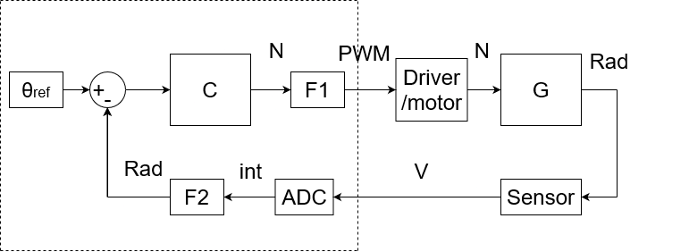
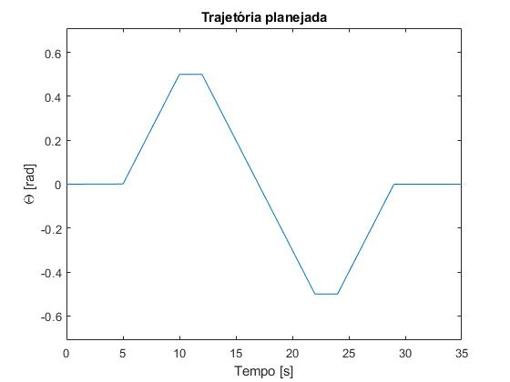
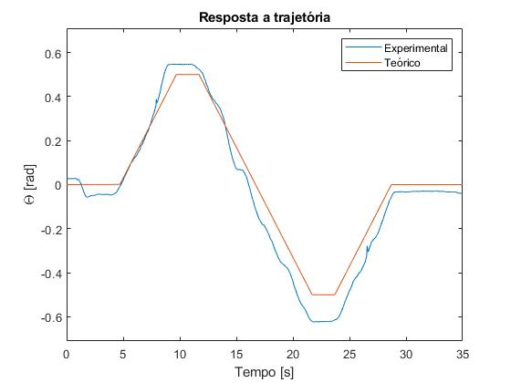
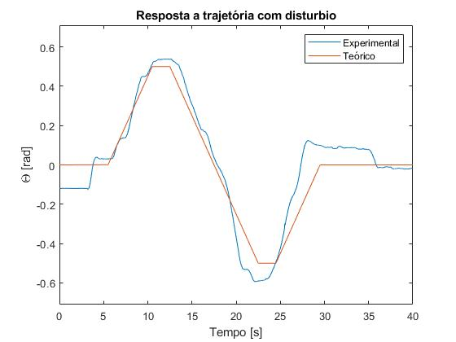

# Controlador de meio drone
Controlador PID discreto implementado em STM32 NUCLEO-F401RE com planejador de trajetória.
A planta é um meio drone exibido na Figura 1.

<p align="center">
Figura 1 - Meio drone.
</p>


A planta em malha fechada pode ser vista na Figura 2.

<p align="center">
Figura 2 - Planta em malha fechada.
</p>




Onde F1 é a função que converte a saída do controlador dada em Newtons para o ciclo de trabalho correspondente que deve ser fornecido ao driver. De forma análoga F2 é a função que converte a leitura do potênciomentro de posição de tensão para radianos.

A planta foi modelada através da resposta a entrada degrau, através da qual sabe-se que possui a forma $$H(s) = \frac{K}{Js^2+Bs} * \frac{A}{s}$$. Depois de realizado o fitting utilizando os dados experimentais obteve-se $$G(s) = \frac{17,34}{s^2+0,4646s} \quad \left[ \frac{\theta}{F} \right]$$.

A partir do modelo da planta foi desenvolvido um controlador PID discreto, para a integral foi utilizado a aproximação trapezoidal, já para a derivada foi utilizado a aproximação Euler para trás. Dessa forma a equação discreta do controlador é dada por  $$u[k] = kp*\left[1 + \frac{1}{Ti} \left( I[k-1] + Ts\frac{e[k] + e[k-1]}{2} \right) \\ + Td\left(\frac{e[k] - e[k-1]}{Ts} \right) \right]$$.

Sendo os ganhos $Kp = 0.113, ~Ti = 16.9, ~Td = 2.16$.

<br/><br/><br/>

## Algoritimo de planejamento de rota
A Figura 3 demonstra a rota que foi implementada no controlador, a rota obedece essa estrutura trapezoidal mas todos os parametros são configuravéis, como inclinação máxima (velocidade angular máxima), tempo morto e posição final.

<p align="center">
Figura 3 - Trajetória trapezoidal implementada.
</p>



As informações da trajetória, como velocidade angular máxima, set point e os instantes da função por partes são armazenadas na estrutura `route_data` dada por:
```
struct r_data{
    float slope_rad_ms;
    float start_pos;
    float set_point;

    uint32_t t0, t1, t2, t3, t4, t5;
};
```
A função `set_route_struct` inicializa a estrutura `route_data` de acordo com parametros fornecidos, como posição final, tempo morto (`time_constant_rad_ms`) e aceleração angular máxima (`MAX_SLOPE_RAD_MS`). Calculando todos os intantes onde ocorre as transições da função por partes que representa a trajetória.
```
void set_route_struct(route_data *d, float start_pos, float set_point, uint32_t time_constant_rad_ms){

    float slope_rad_ms;

    if(set_point-start_pos >= 0.){
        slope_rad_ms = MAX_SLOPE_RAD_MS;
    }
    else{
        slope_rad_ms = -MAX_SLOPE_RAD_MS;
    }

    d->slope_rad_ms = slope_rad_ms;
    d->start_pos = start_pos;
    d->set_point = set_point;

    d->t0 = HAL_GetTick();
    d->t1 = (uint32_t) ((set_point-start_pos)/slope_rad_ms);
    d->t2 = d->t1 + time_constant_rad_ms;
    d->t3 = d->t2 + 2*d->t1;
    d->t4 = d->t3 + time_constant_rad_ms;
    d->t5 = d->t4 + d->t1;
    return;
}
```
Por fim, a função `route_planner` é executada no loop de controle e tem a função de informar ao controlador qual o set point desejado naquele instante. Fazendo com que o drone acompanhe a trajetória através da constante mudança de set point.

```
float route_planner(route_data *d){
    uint32_t t = HAL_GetTick() - d->t0;
    float relative_set_point = 0;

    if(t >= 0 && t < d->t1){
        relative_set_point = d->start_pos + d->slope_rad_ms*t;
    }
    else if(t >= d->t1 && t <d->t2){
        relative_set_point = d->set_point;
    }
    else if(t >= d->t2 && t < d->t3){
        relative_set_point = d->set_point - d->slope_rad_ms*(t - d->t2);
    }
    else if (t >= d->t3 && t < d->t4){
        relative_set_point = 2*d->start_pos - d->set_point;
    }
    else if (t >= d->t4 && t < d->t5){
        relative_set_point = 2*d->start_pos - d->set_point + d->slope_rad_ms*(t - d->t4);
    }
    else{
        relative_set_point = d->start_pos;
    }
    
    return relative_set_point;
}
```
Códigos aqui apresentados estão presentes na <a href="CubeIDE workspace/Core/Src/main.c" class="image fit">main</a>.

<br/><br/><br/>

## Resultados experimentais.
Foi então relizado o teste de acompanhamento de trajetória, como mostra Figura 4. Os dados experimentais foram coletados através da leitura da tensão fornecida pelo potênciometro que faz o papel de sensor da posição ângular, utilizando um osciloscopio.

<p align="center">
Figura 4 - Acompanhamento de trajetória.
</p>



Em seguida foi realizado novamente o experimento de acompanhamento de trajetório, porém desta vez foi adicionado um distúrbio. O distúrbio consiste nos ventos de um ventilador ligado posicionado ao lado da planta (na seção seguinte é incluido um vídeo deste experimento).

<p align="center">
Figura 5 - Acompanhamento de trajetória com distúrbio.
</p>



O que se pode observar é que o drone foi capaz de acompanhar a trajetória até mesmo na presença do distúrbio, dentro de certa margem de erro.

O que se concluiu também a partir do experimento sem disturbio, onde a curva experimental parece levemente deslocada no eixo y, é que muito provavelmente o sensor de posicação esta descalibrado, ou seja, o ociloscópio apresenta um erro de posição diferente daquele lido pelo microcontrolador.

<br/><br/><br/>

## Video demo
Um video que demonstra a resposta ao acompanhamento de trajetória na presença de distúrbio pode ser visto <a href="https://youtube.com/shorts/MJpE3WVZWKM" class="image fit">aqui</a>.

## Apresentação completa final
Para ver todo o desenvolvimento e resultados, incluindo a caracterização dos sensores, motores, equacionamento e implementação do controlador vide apresentação final completa <a href="Apresentação_Meio_Drone_final.pdf" class="image fit">aqui</a>.


